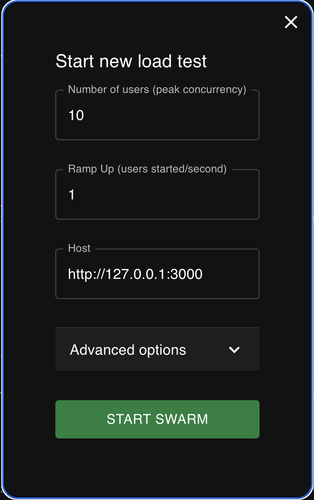

# log-distributor

## Goal
The goal is to design a high-throughput logs distributor that will act as an initial receiver of packets of log messages. The distributor receives log message packets from a number of agents that collect and transmit application/infrastructure logs. The distributor fronts several analyzers, each analyzer being assigned a relative weight (e.g. 0.4, 0.3, 0.1, 0.2). The distributor should route log message packets to analyzers, so that eventually each analyzer analyzes a fraction of log messages roughly proportional to their relative weight.

## Features
- Uses `uvicorn`, an ASGI web server workers for concurrent request handling, cooperative multi-tasking and high-throughput
- Uses `asyncio` to efficiently handle multiple non-blocking operations in parallel within a single request and respond asynchronously
- Uses thread `locks` to guard modifications to shared data structures
- Uses `redis` to maintain shared state among worker threads

## Components:
- Load Generator: Built using Locust, it supplies the Distributor with an unbounded stream of application/infra logs coming from multiple agents
- Distributor: A multi-threaded web-server that can perform high-throughput, non-blocking, thread-safe distribution of log messages
- Analyzer: A service that accepts log messages received from the Distributor based on a pre-defined relative weight

## Project Structure:
```
.
├── distributor
│   ├── distributor.py 
│   └── app.py 
│   └── Dockerfile  
├── analyzer
│   ├── analyzer.py
│   └── Dockerfile
├── loadgen
│   ├── locust.py
└── requirements.txt  
```

## Pre-Requisites
Install the following:
- python 3.9
- docker

## Run Instructions:
- Create a virtual environment
```
python -m venv env
```

- Activate the virtual environment
```
source env/bin/activate
```

- Build all the dependencies
```
pip install -r requirements.txt
```
- Build shared docker network for communication
```
docker network create app-network
```

- Build docker image for all services (Distributor and Analyzer)
```
docker build -t distributor ./distributor
docker build -t analyzer ./analyzer
```

- Start the redis instance (to store shared state)
```
docker run --network app-network --name redis -p 6379:6379 redis
```

- Start the Distributor (single instance)
```
docker run --network app-network -p 3000:3000 --name distributor distributor
```

- Spin up as many instances of Analyzer as needed, each as a separate docker container with a unique ID. When an Analyzer is started, it will automatically call the Distributor to register itself with it. Use the following convention:
```
docker run --network app-network -e ANALYZER_ID={ID} -e -p {INTERNAL_PORT}:{EXTERNAL_PORT} ANALYZER_WEIGHT={WEIGHT} --name analyzer_{ID} analyzer
```

Example usage: This will spin up 3 Analyzers with weights `[0.5, 0.3, 0.2]`
```
docker run --network app-network -e ANALYZER_ID=1 -e ANALYZER_WEIGHT=0.5  -p 3001:3001 --name analyzer_1 analyzer
docker run --network app-network -e ANALYZER_ID=2 -e ANALYZER_WEIGHT=0.3  -p 3002:3002 --name analyzer_2 analyzer
docker run --network app-network -e ANALYZER_ID=3 -e ANALYZER_WEIGHT=0.2  -p 3003:3003 --name analyzer_3 analyzer
```

## Load Test

- Start the locust load generator to simulate requests coming from multiple source nodes
```
locust -f ./loadgen/locust.py
```

- Open a browser tab at `http://localhost:8089/`

- To begin simulating sending of logs, enter the following parameters:
    - Number of Users (peak concurrency): `{INTEGER}`
    - Ramp Up (users started per second): `{INTEGER}`
    - Host: `http://127.0.0.1:3000`
    - Click `Start Swarm`



- When an analyzer goes offline, it will de-register itself with the Distributor so that it no longer receives any logs. To simulate an analyzer going offline, run the following:
```
docker container stop {ANALYZER_CONTAINER_NAME}
docker container rm {ANALYZER_CONTAINER_NAME}
```

 Example usage:
```
docker container stop analyzer_1
docker container rm analyzer_1
```

- To stop all containers, run:
```
docker rm -f $(docker ps -aq)
```

## Manual Testing
- Once the Distributor and Analyzer(s) are up, if you want to send a single log message to the Distributor:
```
curl -X POST -H "Content-Type: application/json" -d '{ "timestamp": 1020, "severity": "WARN", "source": "app", "message": "hello world!" }' http://127.0.0.1:3000/message/send
```
- To send a fixed number of logs:
```
for i in {1..100}; do; curl -X POST -H "Content-Type: application/json" -d '{ "timestamp": 1020, "severity": "WARN", "source": "app", "message": "hello world!" }' http://127.0.0.1:3000/message/send ; done
```
- If you want to see the stats of how many messages are sent to an analyzer at any point in time:
```
curl -X GET http://127.0.0.1:3000/analyzer/stats
```
- If you want to see the logs of any container, run:
```
docker logs {CONTAINER_NAME} --tail=0 --follow
```

## Assumptions:
- The distributor and analyzers are run on the same network and can reach each other
- When an agent comes online / goes offline, it is its responsibility for informing the distributor
- Analyzer IDs are unique
- Even though weights might sum to > 1, they will be normalized proportionately such that all logs are shared based on the relative weights
- Logs will be distributed based on the analyzers that are "online" at any given point in time. When an new analyzer comes online or an existing analyzer goes offline, the weights are re-adjusted and logs will be distributed based on the new relative weights.
- Ports assigned to each analyzer is always available and not bound to another process. Port is assigned to an analyzer in the following manner: `3000 + {ANALYZER_ID}`, and this port is available at analyzer creation time.
- `{ANALYZER_ID}` is an integer and is always `>= 1`
